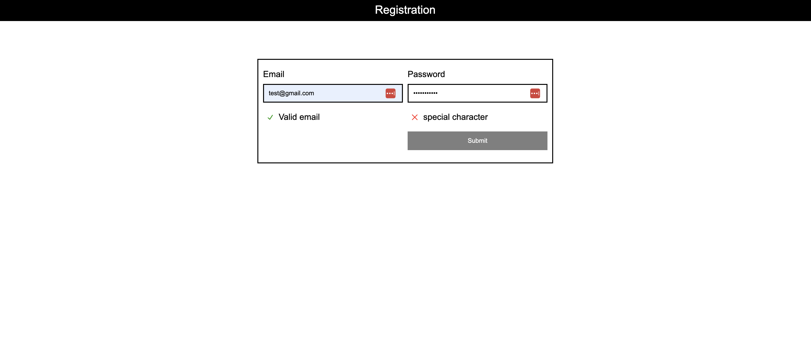

# Registration Form Component
This is a simple registration form component consisting of two inputs (email and password), a password strength indicator, and a submit button. The component has been built using React, styled with CSS, and uses TypeScript for type-checking.

[Jennifer Wjertzoch](mailto:wjertzochjennifer@gmail.com)

## Installation

To install and run the project, follow these steps:

Clone the repository: `git clone https://github.com/your-username/registration-form.git`

To install the dependencies run:

`npm install`

And to run the app:

`npm start`

Open the app in your browser at http://localhost:3000

## Usage
Once the app is running, you can interact with the registration form by entering your email and password. The password strength indicator will update in real time to provide feedback on the strength of your password. The submit button will be enabled only when the password meets all of the required criteria:

- 8 or more characters
- 1 or more lowercase letters
- 1 or more uppercase letters
- 1 or more decimal characters
-	1 or more special characters

## Libraries / Tools Used
The following technologies were used to build this project:

- React
- CSS
- TypeScript

## Proposed Solution

- Breaking the UI into components
	* Header
	* Registration

- Creating the root component App.js
	* Set up project structure and basic files

- Create registration form component
	* Create registration form component with two inputs and labels
	* Add password strength indicator to form
	* Implement validation for password input using regular expressions
	*	Disable submit button until password meets validation criteria

- Style registration form component
	* Style registration form component and password strength indicator
	* Add media queries for responsive design
	* Improve accessibility of registration form component	

## Screenshots

### Running the tests

#### Unit Tests

You can run the unit tests using:

`npm test`
